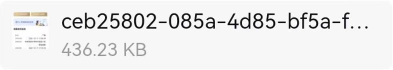
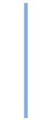
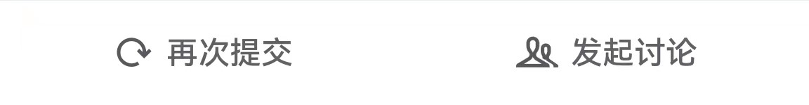

<html>
<head>
    <title>离校申请</title>
    

</head>
    <body>
        

            

                <td><strong>疫情期间学生临时出校申请纪念版</strong></td>
            

            
此申请由[审批]应用提交

            

                

                
<strong>小花狮的疫情期间学生临时出校申请纪念版</strong>

                

                    
已通过

                

            

            

            

                

                    
审批编号

                    
202212147603

                

                

                    
提交时间

                    
2022/12/14 23:33

                

                

                    
所在部门

                    
树学科学学院

                

                

                    
学号

                    
114514

                

                

                    
宿舍

                    
校长办公室

                

                

                    
于2020年 - 2022年提交过的出校事由

                    

                        想吃KFC，冷拿衣服，吃猫，摸鱼，翅膀硬了，
                        rng被淘汰了很难过要出去散心，陪ljh出去呼吸空气，
                        申请一下出校看看接下来会发生什么，听说能出校了试一下是不是真的，
                        去山的那边海的那边找一群蓝精灵，受邀去北京开会，
                        女儿要生了，粗去朴昌，锻炼免疫系统，吸收病毒
                    

                

                

                    
临时出校开始日期

                    
2022/12/14

                

                

                    
临时出校结束日期

                    
永远

                

                

                    
随申码截图

                    

                

                

                    
核酸检测报告

                    

                

            

            

            

                <strong>审批流程</strong>
                

                    

                    
审批人·已同意

                

                

                    

                    
<table><tr width="300px" height="10px"></tr></table>

                    

                    
马保国

                    
已同意·12/14 23:58

                

                

                    

                    
审批人·已同意

                

                

                    
<table><td style="width:30px"></td></table>

                    

                    
王境泽

                    

                

                

                    
<table><td style="width:30px"></td></table>

                    

                    
赵向前

                    

                

                

                    
<table><td style="width:30px"></td></table>

                    

                    
张美玉

                    
已同意·12/14 23:59

                

            

            

            
添加备注

            

            

        

    </body>
</html>
